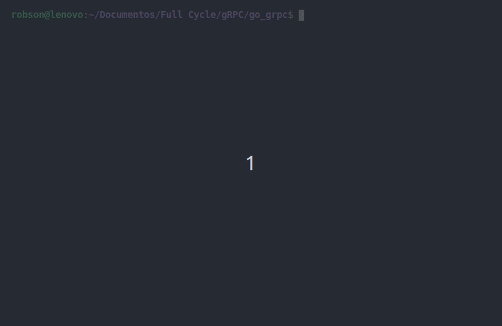

## Criando um Servidor gRPC com GoLang

</img>

#### Pré-requisitos
Partindo do principio que você já possui a GoLang instalada em sua maquina precisamos fazer a instalação do <b>protoc</b>. Ele é o responsavel pela geração do códifo golang apartir de um arquivo de configuração *.proto


##### Instalando o protoc
``` bash
sudo apt install protobuf-compiler
```

##### Instalando pacotes do GO para trabalhar com gRPC
``` bash
go get -u google.golang.org/grpc
```

``` bash
go get -u github.com/golang/protobuf/protoc-gen-go
```

##### Gerando o código GO para trabalhar com gRPC

Criando o diretório para armazenar o arquivo .go gerado apartir do arquivo .proto
``` bash
mkdir pb
```

Dentro do diretorio <b>/proto</b> existe um arquivo com extensão .proto, responsável por formalizar o contrado de comunicação entre Cliente e Servidor

Abaixo temos o comando responsável por gerar o código Go apartir de um arquivo .proto
``` bash
protoc --proto_path=proto proto/*.proto --go_out=plugins=grpc:pb
```

##### Fazendo a comunição com o serviço usando Evans
``` bash
evans -r -p 8080
```

Referências: 
https://dev.to/koddr/enter-to-grpc-in-go-first-server-4a5g